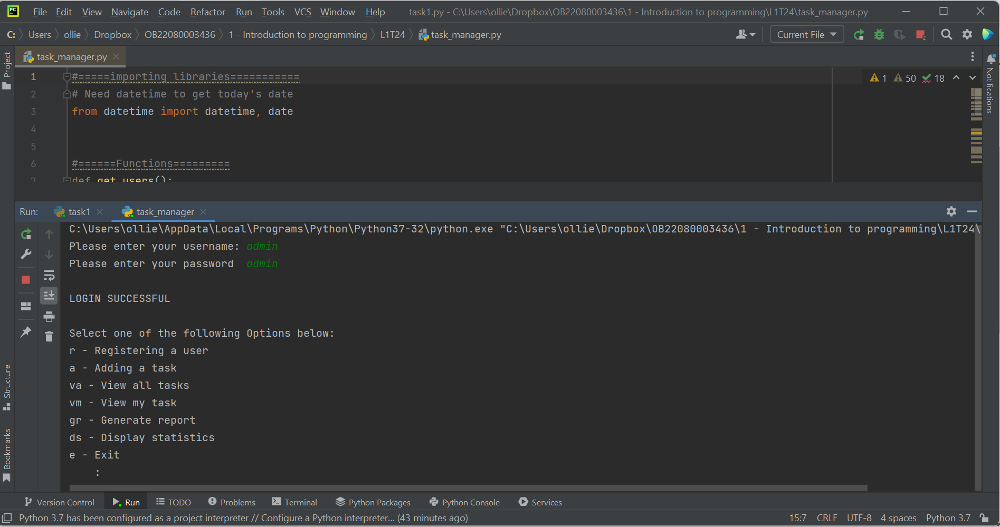

# Capstone-2-3---Business-tasks-manager
A simple Python program to delegate and track users and tasks

# Instalation

This project uses Python and an IDE to work.
If you do not have Python, you can download it here: https://www.python.org/downloads/
If you do not have an applicable IDE you can download a free version of PyCharm here: https://www.jetbrains.com/pycharm/download/

1. Download the files to a folder on your desktop.
2. Right-click on the .py file and open with PyCharm 
3. Once the file has loaded in PyCharm, click the green triangle in the top right corner to run the program.

# Usage

Once the program is running you need to log in as an administrator. 
You do this by entering 'admin' as the username and then again as the password.
You can then use the program by entering one of the following:
r - Registering a user
a - Adding a task
va - View all tasks
vm - View my task
gr - Generate report
ds - Display statistics

